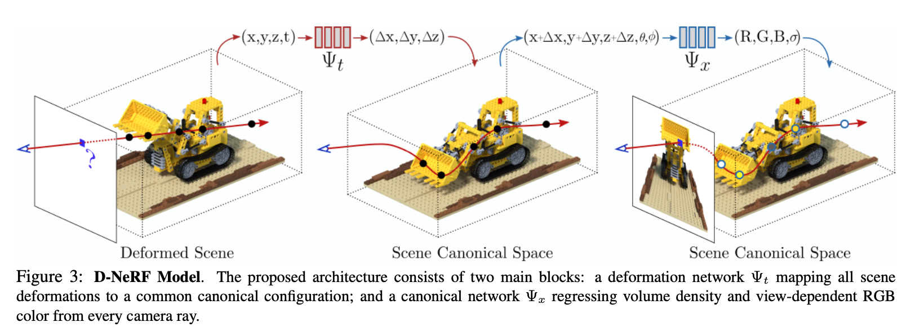

### D-NeRF: Neural Radiance Fields for Dynamic Scenes

[**project**](https://www.albertpumarola.com/research/D-NeRF/index.html)|[**paper**](https://arxiv.org/abs/2011.13961)[|**code**](https://github.com/albertpumarola/D-NeRF)

#### **Overview**

NeRF is only applicable to static scenes, where the same spatial location can be queried from different images. Nerf add t in to input and use a single view per time instance. Which kind of like fix the camera and move object. (Nerf can been seen as fix the object and move camera.)

#### **Technique**

1. **Deformation Network** 

   Ψt : (x, t) → ∆x.

   Then Ψx : (x + ∆x, d) → (c, σ) is the same as original nerf.

#### **Note**

1.No latent encoding

