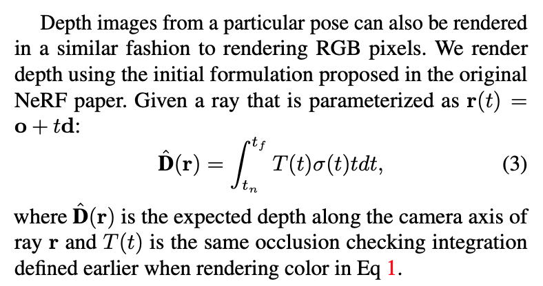
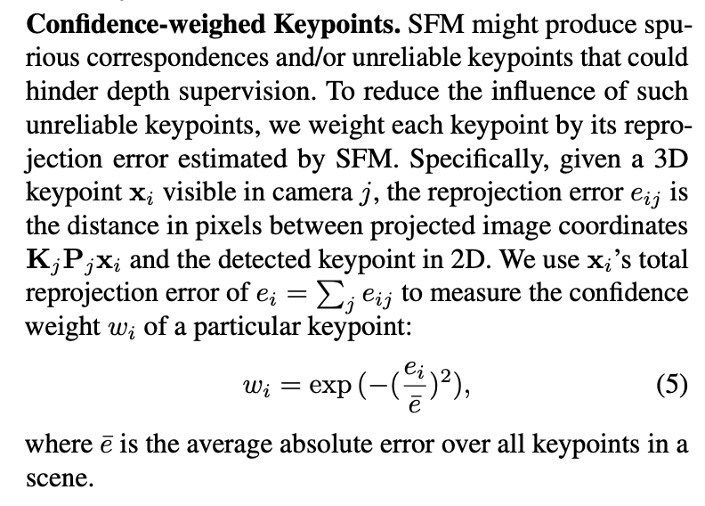

### Depth-supervised NeRF: Fewer Views and Faster Training for Free

[**project**](https://www.cs.cmu.edu/~dsnerf/)|[**paper**](https://arxiv.org/abs/2107.02791)|[**code**](https://github.com/dunbar12138/DSNeRF)

#### **Overview**

Nerf + depth supervision

#### **Technique**

1. **Depth Supervision Loss**

   

2. **Confidence-weighed Keypoints**

    

#### **Note**

