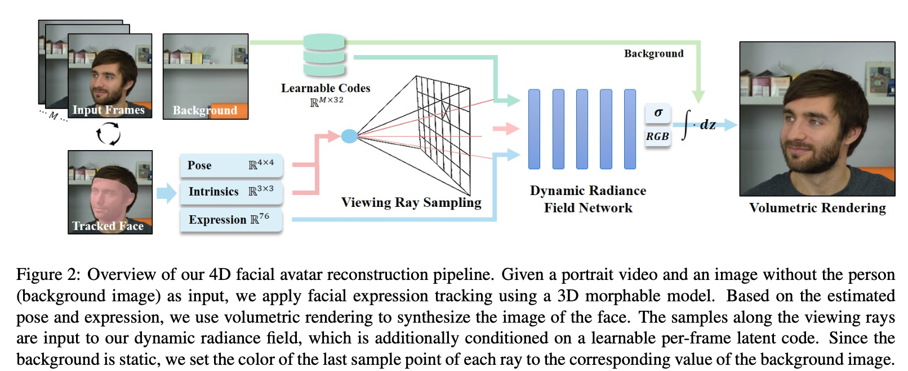
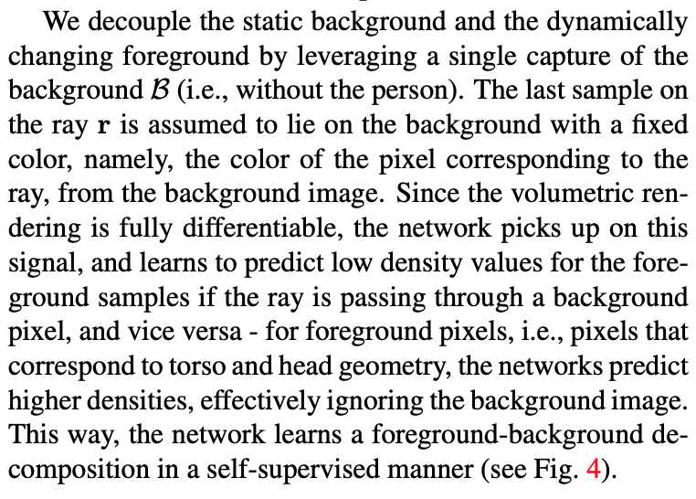

### Dynamic Neural Radiance Fields for Monocular 4D Facial Avatar Reconstruction

[**paper**](https://arxiv.org/abs/2012.03065)[|**code**](https://github.com/gafniguy/4D-Facial-Avatars)

#### **Overview**

Dynamic neural radiance fields for modeling the appearance and dynamics of a human face (4D facial avatar, expression and movement.).

#### **Technique**

1. Pose, Intrinsics and Expression are obtained using an optimization-based facial reconstruction and tracking [pipeline](https://arxiv.org/abs/2007.14808). 

2. Pose and Intrinsics are used to transform the ray sample points to the canonical space of the head model.

3. Background. Still not sure how to use and need to check code.

   

#### **Note**

1.Not yet

