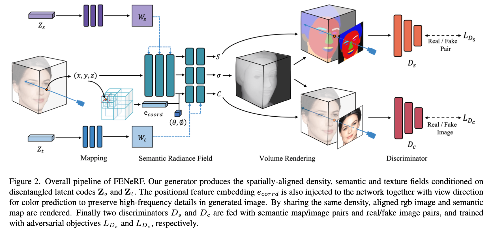
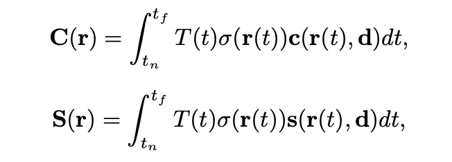

### FENeRF: Face Editing in Neural Radiance Fields

arXiv 11/30/2021

[**paper**](https://arxiv.org/abs/2111.15490)

#### **Overview**

*Previous portrait image generation methods roughly fall into two categories: 2D GANs and 3D-aware GANs. 2D GANs can generate high fidelity portraits but with low view consistency. 3D-aware GAN methods can maintain view consistency but their generated images are not locally ed- itable. To overcome these limitations, we propose FENeRF, a 3D-aware generator that can produce view-consistent and locally-editable portrait images.*

#### **Technique**

1. Take as input the 3D point coordinates x = (x,y,z), viewing

   direction d = (θ, φ) and the learned positional feature embedding e~coord~. Then generates the view-invariant density σ  and semantic labels s~r~  conditioning on shape latent code z~s~, as well as the view-dependent colour c~r~ conditioning on texture code z~c~.

1. Render color C~r~ and semantic label probabilities S~r~.

   

2. D~c~ discriminates the fidelity of generated portraits. Semantic masks, in addition to face images, are taken as input to D~s~. Moreover, we append two channels of D~c~ to predict camera pose and then apply camera pose correction loss with sampled ones.

    

#### **Note**

