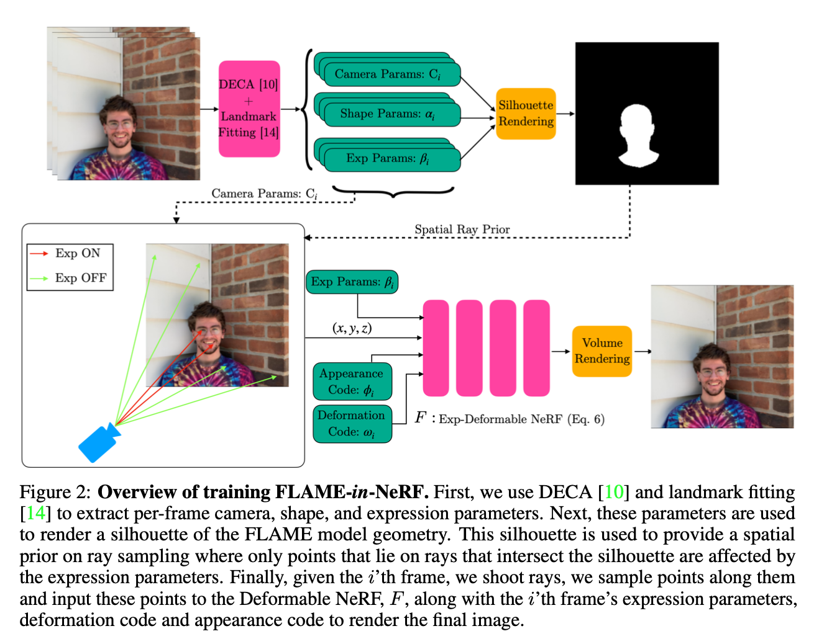
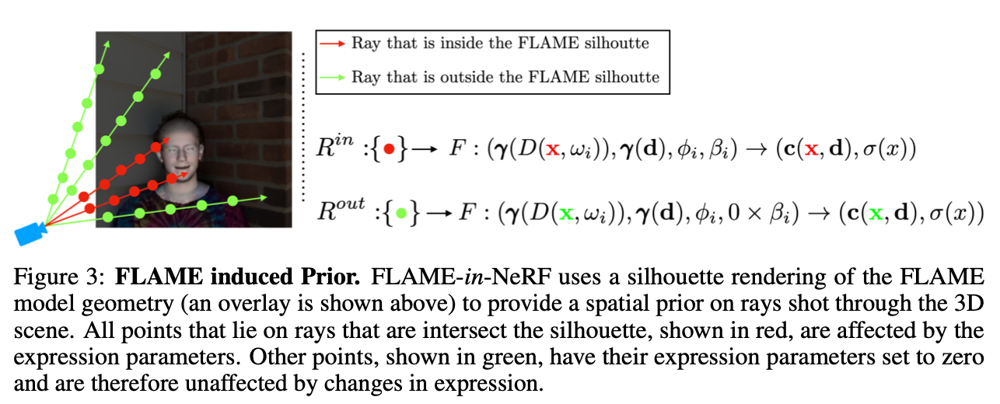

### FLAME-*in*-NeRF: Neural control of Radiance Fields for Free View Face Animation

ICLR 2022 reject

[**project**](https://shahrukhathar.github.io/2021/08/12/FLAMEinNeRF.html)|[**paper**](https://arxiv.org/abs/2108.04913)

#### **Overview**

FLAME-*in*-NeRF is a method for arbitrary facial expression control and novel view synthesis of scenes captured in portrait videos.

DECA and landmark fitting to extract per-frame camera, shape, and expression parameters

#### **Technique**

1. DECA and landmark fitting to extract per-frame camera, shape, and expression parameters.

   

2. Render a silhouette of the FLAME model geometry.

   

3. Spatial Prior for Ray Sampling

   

4. Expression Control in Deformable Neural Radiance Fields ([Nerfies](https://nerfies.github.io/))

   

   

#### **Note**

1. Reject by ICLR 2022

