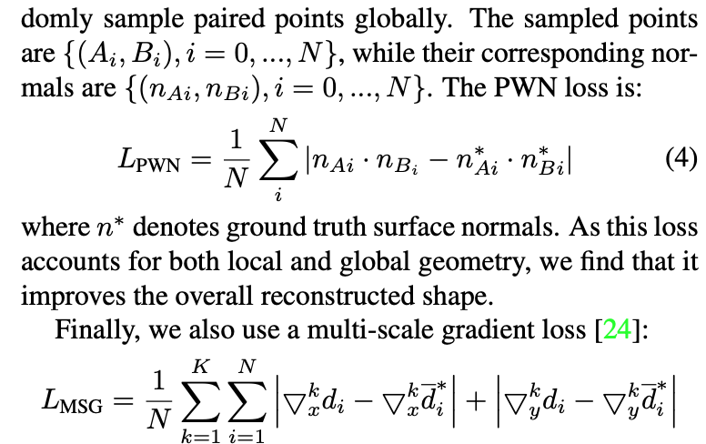

### Learning to Recover 3D Scene Shape from a Single Image

CVPR'21 Best Paper Finalist.

[**paper**](https://arxiv.org/abs/2012.09365)|[**code**](https://github.com/aim-uofa/AdelaiDepth)

#### **Overview**

*Recent state-of-the-art methods cannot be used to recover accurate 3D scene shape due to an unknown depth shift induced by shift-invariant reconstruction losses used in mixed-data depth prediction training, and possible unknown camera focal length. We investigate this problem in detail, and propose a two-stage framework that first predicts depth up to an unknown scale and shift from a single monocular image, and then use 3D point cloud encoders to predict the missing depth shift and focal length that al- low us to recover a realistic 3D scene shape.*

#### **Technique**

1. **Point Cloud Module**

   Image I -> *depthmap* d, *albedo image* a, *light direction* l, *viewpoint* w 

   The image I is reconstructed from the four factors in two steps, *lighting* Λ and *reprojection* Π

   

2. **Monocular Depth Prediction Module**

   (1) Image-level normalized regression loss.

   Design a loss based on tanh normalization and a trimmed Z-score to solve varied depth ranges and effect of outliers and long-tail residuals.

   (2) Pair-wise normal loss.

   Sample paired points on both sides of edges and  also on the same plane. 

   

   

   

#### **Note**

