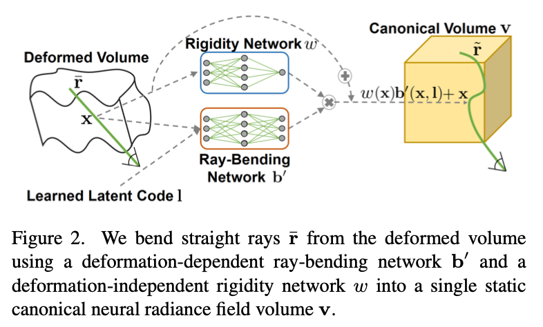
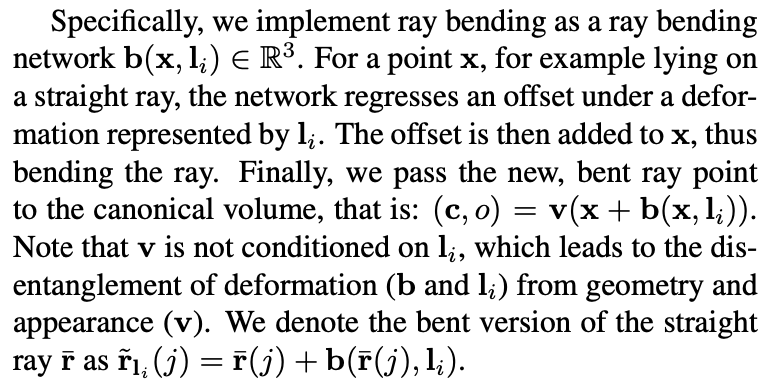
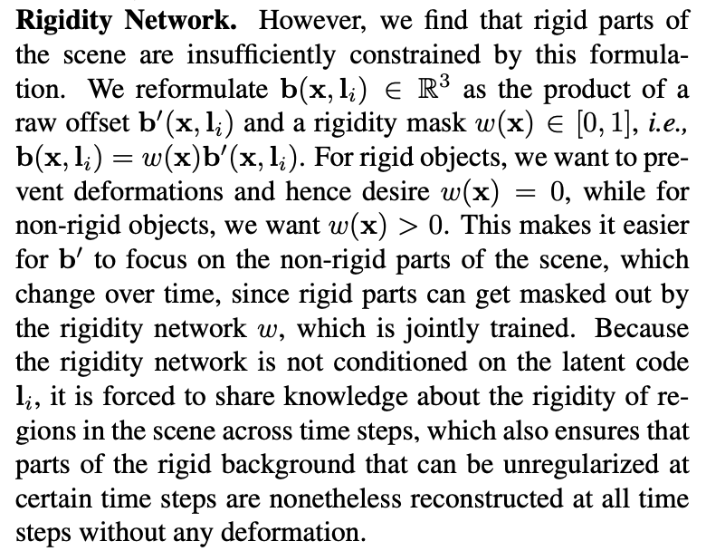
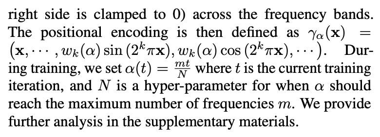

### Non-Rigid Neural Radiance Fields: Reconstruction and Novel View Synthesis of a Dynamic Scene From Monocular Video

[**project**](https://vcai.mpi-inf.mpg.de/projects/nonrigid_nerf/)|[**paper**](https://arxiv.org/abs/2012.12247)[|**code**](https://github.com/facebookresearch/nonrigid_nerf)

#### **Overview**

A reconstruction and novel view synthesis approach for general non-rigid dynamic scenes.

#### **Technique**

1. Assume Lambertian materials and thus remove the view-dependent layers of rigid NeRF, *i.e.,* set c = c(x). 

2. Since each image corresponds to a different deformation of the volume in our non-rigid setting, we also learn a latent code for each time step, which is then used as input for the ray bending network which parameterizes scene deformations. The weights of this network and the latent codes are shared between v~c~ and v~f~ .

3. Ray-Bending Network

   

4. Rigidity Network

   

   

5. Offsets Loss and Divergence Loss. Refer to paper for detail.

#### **Note**

1.Use an exponent to balance l1 and l2 loss is an interesting idea.

