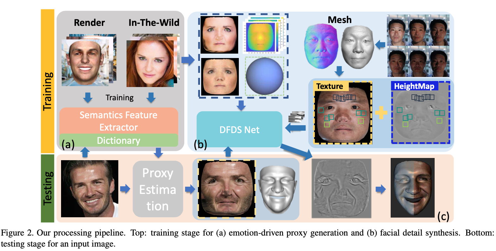
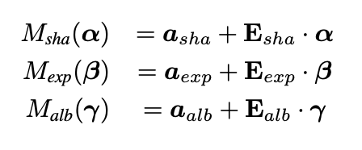
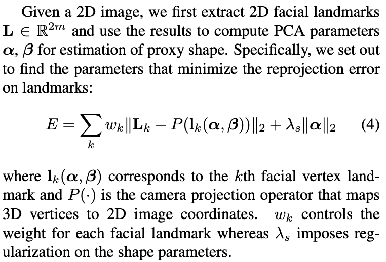
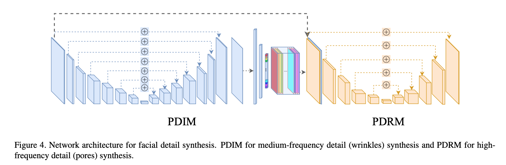
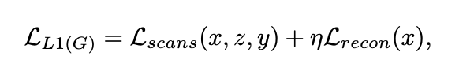
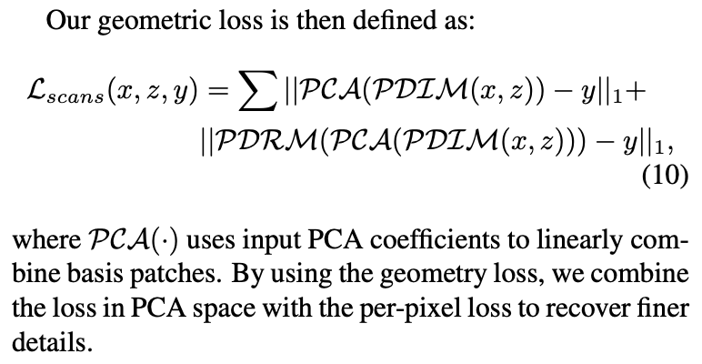

### Photo-Realistic Facial Details Synthesis From Single Image

ICCV2019 Oral

[**paper**](https://arxiv.org/abs/1903.10873)|[**code**](https://github.com/apchenstu/Facial_Details_Synthesis)

#### **Overview**

*We present a single-image 3D face synthesis technique that can handle challenging facial expressions while recov- ering fine geometric details.* 

#### **Technique**

1. **Expression-Aware Proxy Generation**

   Employ the *Basel Face Model*, which consists of three components: shape M~sha~, expression M~exp~ and albedo M~alb~.

   

   

   During each round of iterations, we first fix α and solve for P (·) using the *Gold Standard Algorithm*. We then fix P (·) and solve for α. To bootstrap this iterative scheme, we initialize α as 0.

   For expression parameters β, we fix it as prior param eters β~prior~.

   First, train an emotion feature predictor EmotionNet.

   Next, randomly generate expression parameters β from normal distribution in interval [−3, 3] and render 90K images with different facial expressions. We feed the images into the trained EmotionNet and obtain a total of 90K emotion feature vectors.  We also use another method to estimate 90K appearance feature vectors on the images.

   Concatenating these emotion feature vectors along with their corresponding appearance feature vectors, we obtain the semantic feature vector for each of the 90K images. Now we have a dictionary: semantic feature -> expression.

   Given a new image I, we first feed it to EmotionNet and appearance feature predictor to obtain its semantic feature vector. We then find its closest semantic feature vector in the dictionary and use the corresponding expression parameters for β~prior~.

2. **Deep Facial Detail Synthesis**

   Network Architecture

supervised loss + unsupervised loss

supervised loss: Obtain a ground truth displacement map for each geometry pair using own capture system. 

unsupervised loss

we obtain 163K in-the-wild images, estimate its proxy and geometric details (using network), and then use this information to calculate lighting and albedo. Finally, we re-render an image with all these es- timations and compute reconstruction loss against the input image during training.

#### **Note**

