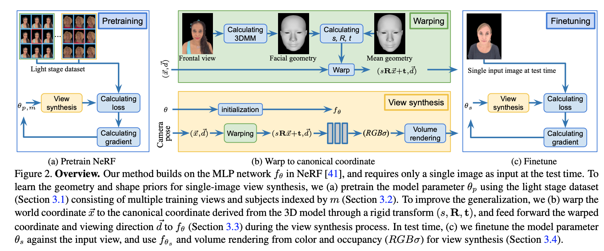
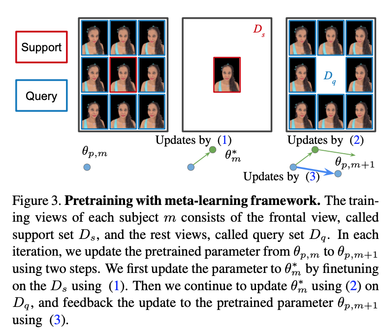

### Portrait Neural Radiance Fields from a Single Image

[**project**](https://portrait-nerf.github.io/)|[**paper**](https://arxiv.org/abs/2012.05903)

#### **Overview**

*We present a method for estimating Neural Radiance Fields (NeRF) from a single headshot portrait.*

#### **Technique**

1. **Pretraining NeRF with meta-learning framework**

   

   

#### **Note**

