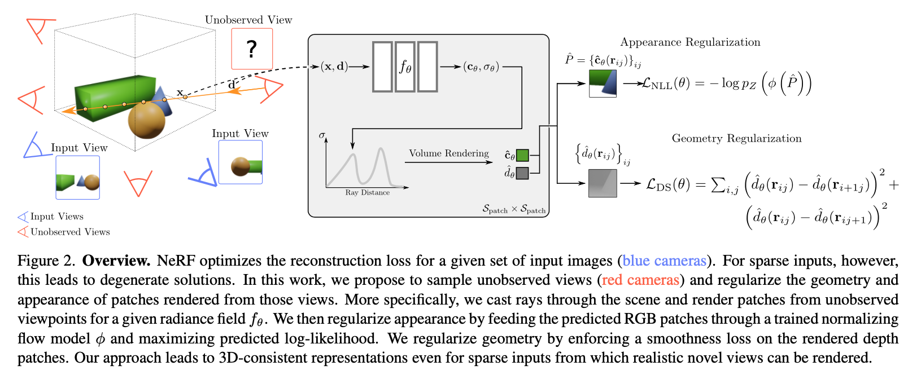
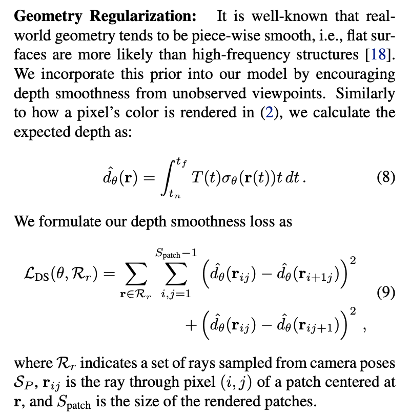
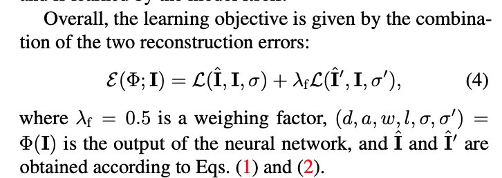
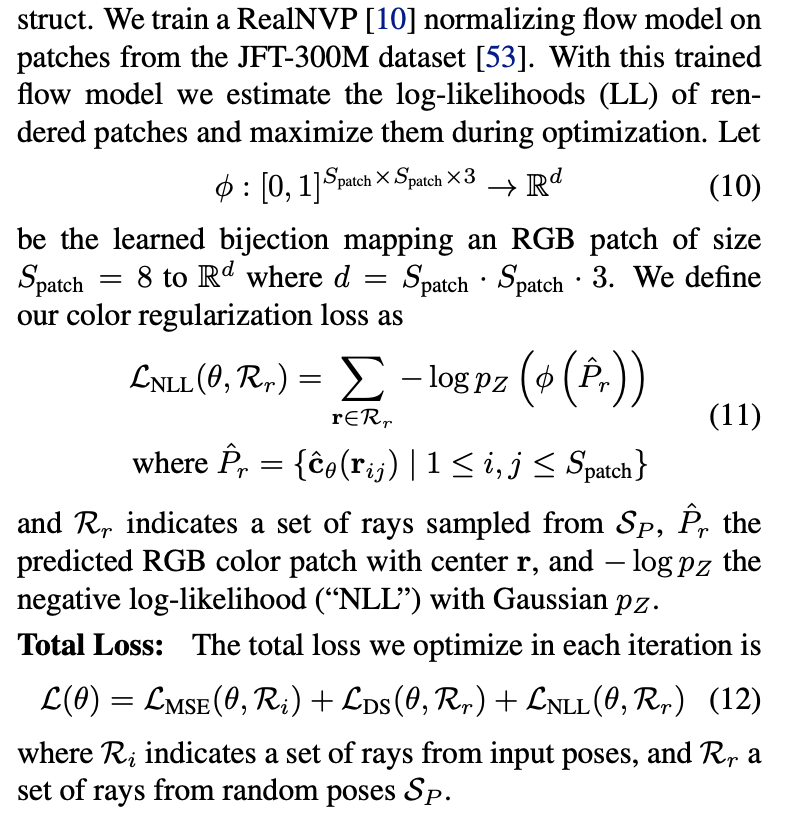
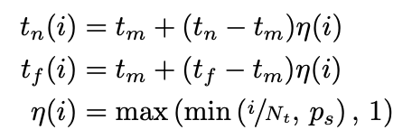

### RegNeRF: Regularizing Neural Radiance Fields for View Synthesis from Sparse Inputs

arXiv Dec 1, 2021 

[**project**](https://m-niemeyer.github.io/regnerf/index.html)|[**paper**](https://arxiv.org/abs/2112.00724)

#### **Overview**

*A novel method for regularizing NeRF models for sparse input scenarios.*

#### **Technique**

1. Sample camera poses (locations and rotations) from bounding the set of poses from which we would like to render novel views at test time. 

2. **Geometry Regularization**

    

   

3. **Color Regularization**

   
   
3. **Sample Space Annealing**

   We find that annealing the sampled scene space quickly over the early iterations during optimization helps to avoid this problem.
   
   

#### **Note**

