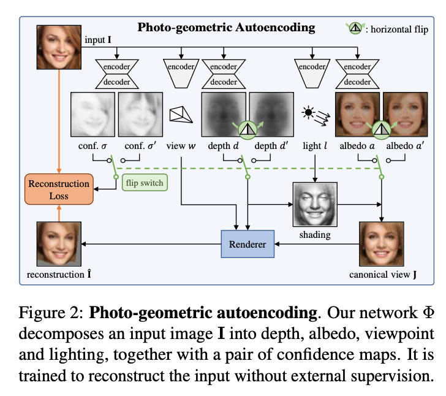
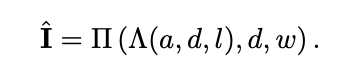
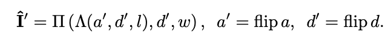
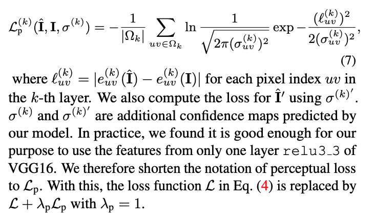

### Unsupervised Learning of Probably Symmetric Deformable 3D Objects from Images in the Wild

CVPR 2020

[**project**](https://elliottwu.com/projects/unsup3d/)|[**paper**](https://arxiv.org/abs/1911.11130)|[**code**](https://github.com/elliottwu/unsup3d)

#### **Overview**

*We propose a method to learn 3D deformable object cate- gories from raw single-view images, without external super- vision.*

#### **Technique**

1. **Photo-geometric autoencoding**

   Image I -> *depthmap* d, *albedo image* a, *light direction* l, *viewpoint* w 

   The image I is reconstructed from the four factors in two steps, *lighting* Λ and *reprojection* Π

   

2. **Probably symmetric objects**

    Flip the map d and a. Obtain a second reconstruction I from the

   flipped depth and albedo:

   
   
   then we have loss:
   
   
   
   

3. **Perceptual loss**

   

#### **Note**

