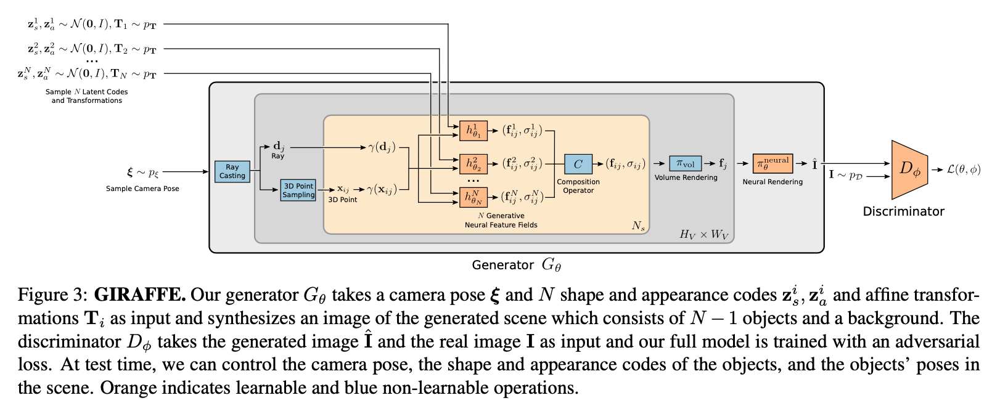
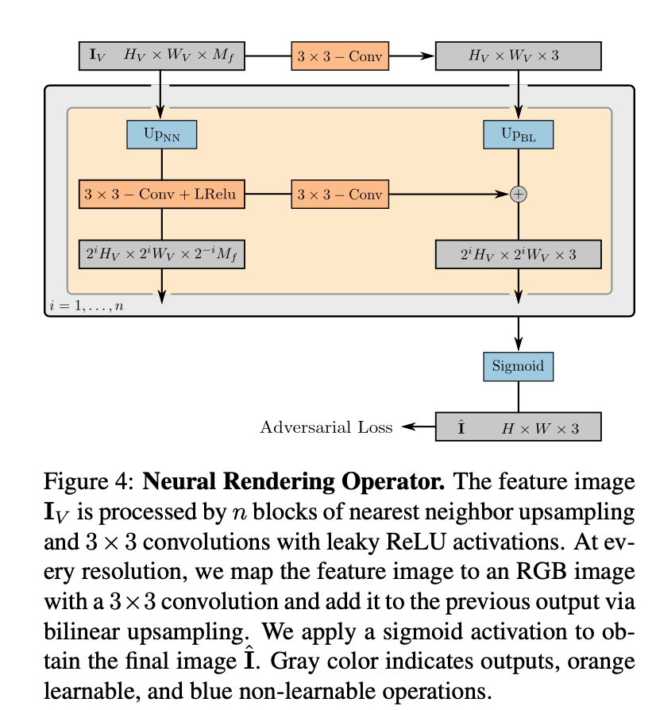

### GIRAFFE: Representing Scenes as Compositional Generative Neural Feature Fields

[**project**](https://m-niemeyer.github.io/project-pages/giraffe/index.html)|[**paper**](http://www.cvlibs.net/publications/Niemeyer2021CVPR.pdf)[|**code**](https://github.com/autonomousvision/giraffe)

#### **Overview**

*Representing scenes as compositional generative neural feature fields allows us to disentangle one or multiple objects from the background as well as individual objects’ shapes and appearances while learning from un- structured and unposed image collections without any additional supervision.*

#### **Technique**

1. Ouptut f (feature) rather than c(color) and then use feature to get color.

   

2. Affine transformation, shape and appearance codes for each object to control over the pose, shape and appearance of individual objects.

#### **Note**

1.Dataset Bias, e.g. all the faces are looking towards camera in training set so can generate only faces looking towards the camera.

2. Can disentangle but not too strong.

