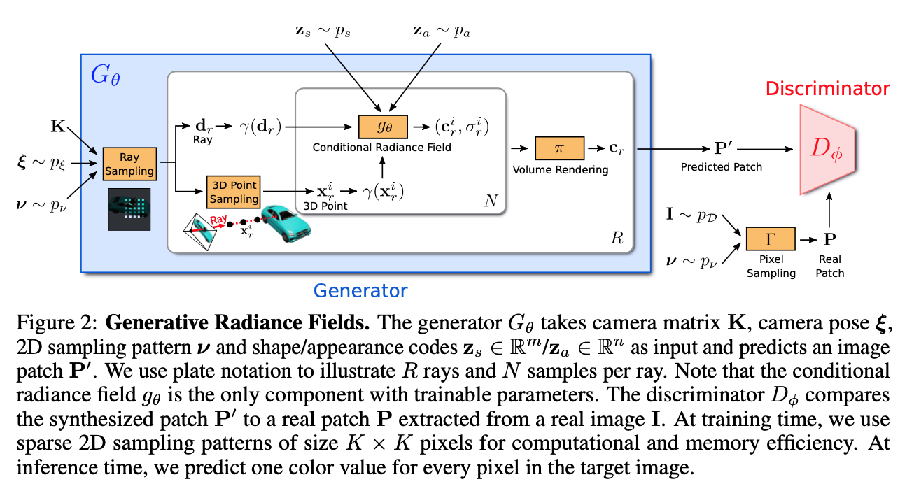
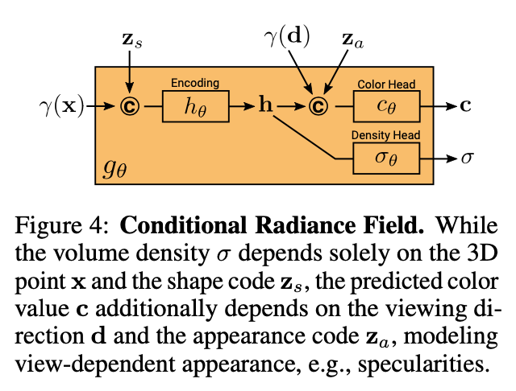

### GRAF: Generative Radiance Fields for 3D-Aware Image Synthesis

[**paper**](https://avg.is.tuebingen.mpg.de/publications/schwarz2020neurips)[|**code**](https://github.com/autonomousvision/graf)

#### **Overview**

GAN+Nerf

#### **Technique**

1. Generator output patch while training and output whole image while doing inference.
2. Each generator/discriminator for one object.

#### **Note**

1. Pose vs shape/texture/appereance can be disentangled but among shape/texture/appereance may not.

