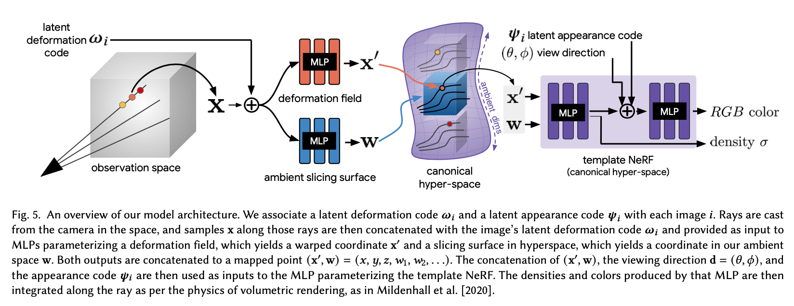
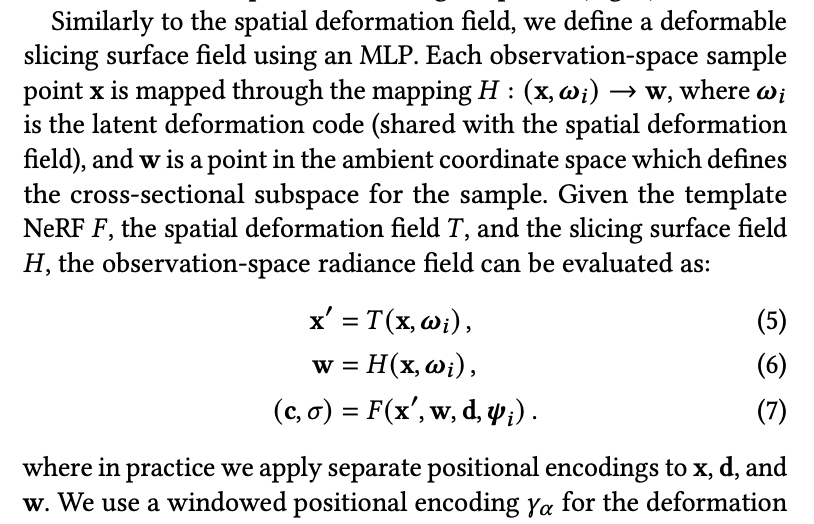

### HyperNeRF: A Higher-Dimensional Representation for Topologically Varying Neural Radiance Fields

SIGGRAPH Asia 2021

[**project**](https://hypernerf.github.io/)|[**paper**](https://arxiv.org/abs/2106.13228)|[**code**](https://github.com/google/hypernerf)

#### **Overview**

*Deformation-based approaches struggle to model changes in topology, as topological changes require a discontinuity in the deformation field, but these deformation fields are necessarily continuous.We address this limitation by lifting NeRFs into a higher dimensional space, and by representing the 5D radiance field corresponding to each individual input image as a slice through this "hyper-space".*

Handle significant deformation or topological variation.

#### **Technique**

1. A combination of deformation- based and modulation-based approaches.

   deformations + additional higher-dimension coordinates as input

   

2. Not sure how it make w represent ambient space.

   

   

   

#### **Note**

