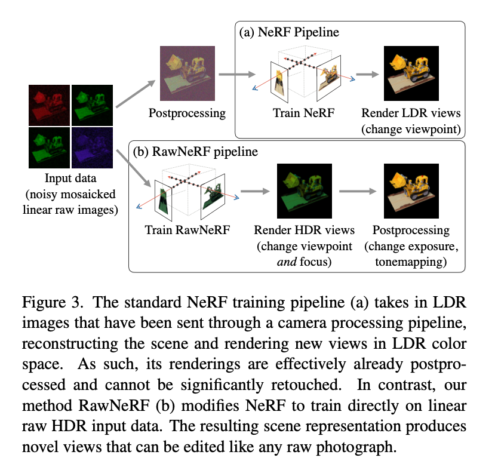

### NeRF in the Dark: High Dynamic Range View Synthesis from Noisy Raw Images

[**project**](https://bmild.github.io/rawnerf/index.html)|[**paper**](https://arxiv.org/abs/2111.13679)

#### **Overview**

Based on original NeRF, using raw HDR image with noise as input and output clean new viewpoint images. 

#### **Technique**

1. Loss function. Overcome large magnitude between bright and dark regions.

2. Variable exposure training. Use a sequence of images I~i~

   with exposure times t~i~ ,output to match the brightness in image I~i~ by scaling it by the recorded shutter speed t~i~.

#### **Note**

