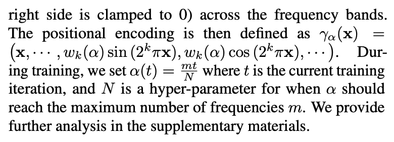

### Nerfies: Deformable Neural Radiance Fields

[**project**](https://nerfies.github.io/)|[**paper**](https://arxiv.org/abs/2011.12948)[|**code**](https://github.com/google/nerfies)

#### **Overview**

An extension to NeRF to handle non-rigidly (e.g., it is hard for people to stay completely still when posing for a photo, or worse, when waving a phone when capturing themselves in a selfie video.) deforming objects that optimizes a deformation field per observation.

#### **Technique**

1. **Neural Deformation Fields**. 

   Add deformation network before original nerf so (x,y,z) that feed into nerf is after deformation.

   

2. **Elastic Regularization**. 

   **Elastic Energy**. Add rigidity priors suitable for deformation fields defined by neural networks. The Jacobian J~T~ (x) of this mapping at a point x ∈ R^3^ describes the best linear approximation of the transformation at that point. We can therefore control the local behavior of the deformation through  J~T~. 

   

   **Robustness**. Although humans are mostly rigid, there are some movements which can break our assumption of local rigidity, e.g., facial expressions which locally stretch and compress our skin. We therefore remap the elastic energy defined above using a robust loss:

   

3. **Background Regularization**

   

4. **Coarse-to-Fine Deformation Regularization.**

   A coarse-to-fine regularization approach that modulates the capacity of the deformation field to model high frequencies during optimization. [Tancik *et al*](https://arxiv.org/pdf/1707.05776.pdf). show that controls it the smoothness of the network: a low value of m results in a low-frequency bias (low resolution) while a higher value of m results in a higher-frequency bias (high resolution). With a small m for the deformation field, the model cannot capture the minute motion of the smile; conversely, with a larger m, the model fails to correctly rotate the head because the template overfits to an underoptimized deformation field

   

   

#### **Note**

1.Not yet

