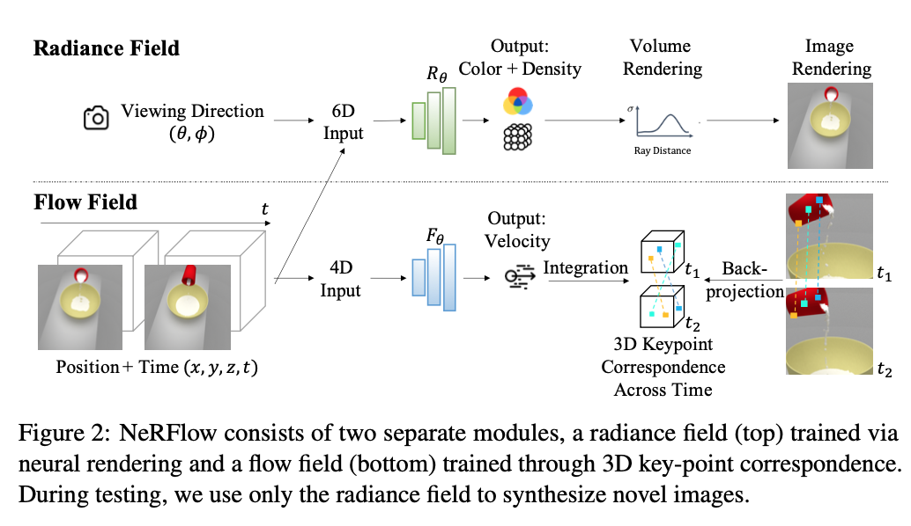
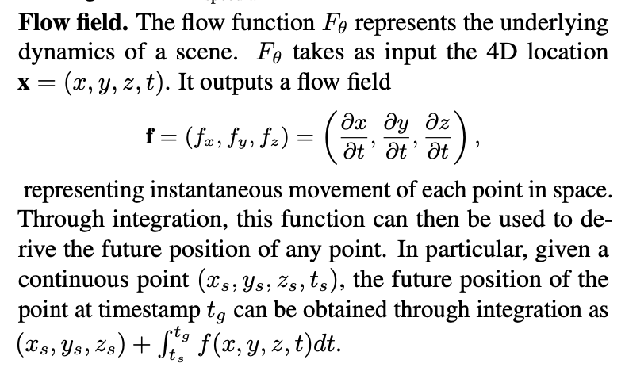
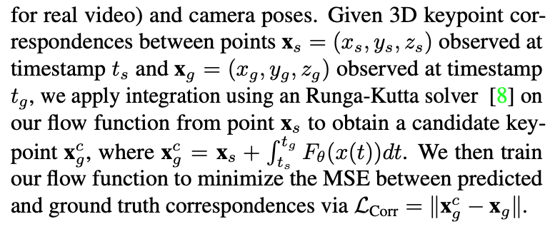

### Neural Radiance Flow for 4D View Synthesis and Video Processing

[**project**](https://yilundu.github.io/nerflow/)|[**paper**](https://arxiv.org/abs/2012.09790)|[**code**](https://github.com/yilundu/nerflow)

#### **Overview**

*We present a method, Neural Radiance Flow (NeRFlow), to learn a 4D spatial-temporal representation of a dynamic scene from a set of RGB images.*

#### **Technique**

1. **Radiance field.**

   Decompose the predicted color to a view-invariant diffuse part c~diffuse~ and a view-dependent specular part c~specular~. Since specularity is typically sparsely observed, during training we add an L2 regularization loss to the magnitude of c~specular~.

2. **Flow field**. 

   

2. **Appearance consistency**.

   The diffuse reflectance of an object remains constant while it is moving around. 
   
2. **Density consistency**

   Similar to appearance.
   
2. **Motion consistency**

2. **Volume rendering for image supervision**

   Similar to NeRF
   
2. **Optical flow supervision**

   
   
   

#### **Note**

