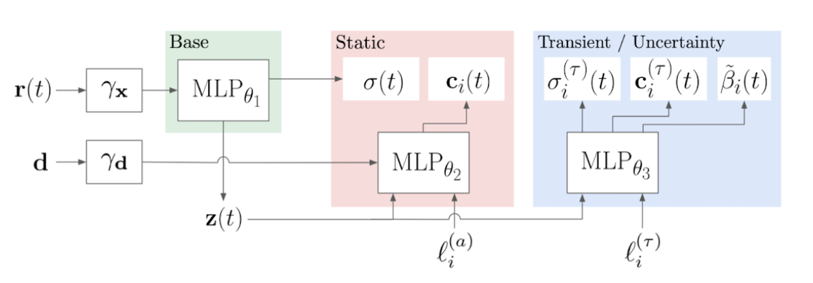
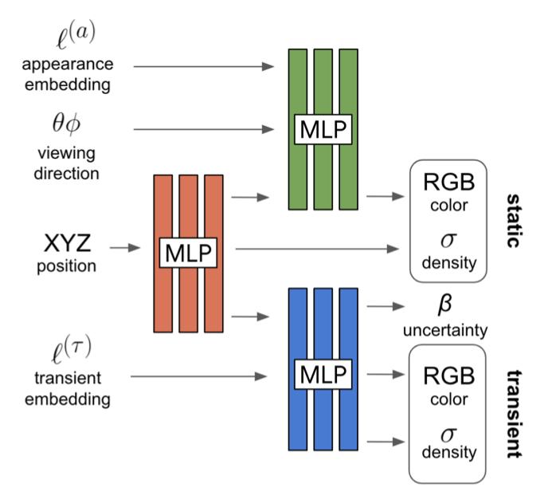
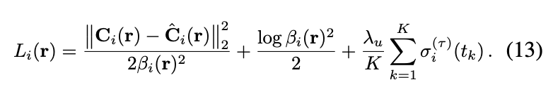
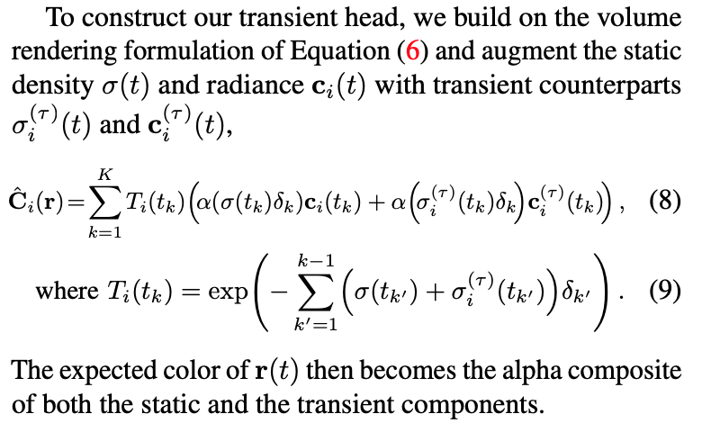

### NeRF in the Wild: Neural Radiance Fields for Unconstrained Photo Collections

[**paper**](https://arxiv.org/abs/2008.02268)[|**code**](https://github.com/kwea123/nerf_pl)

#### **Overview**

Modeling ubiquitous, real-world phenomena in uncontrolled images, such as variable illumination or transient occluders based on Nerf.

#### **Technique**

1. Add two emebeddings vectors, which are used to allow the Static and Transient networks to perform their respective tasks. The two emebeddings vectors are initialized randomly and are learned alongside the training process.

2. Output additional level of uncertainty $\beta$ and render similar as C and add into loss function.

   

2. Render Static and Transient  parts simultaneously.

#### **Note**

1.Still requires developments to eliminate some smudges and improve the yield in those areas not represented in the photos.
