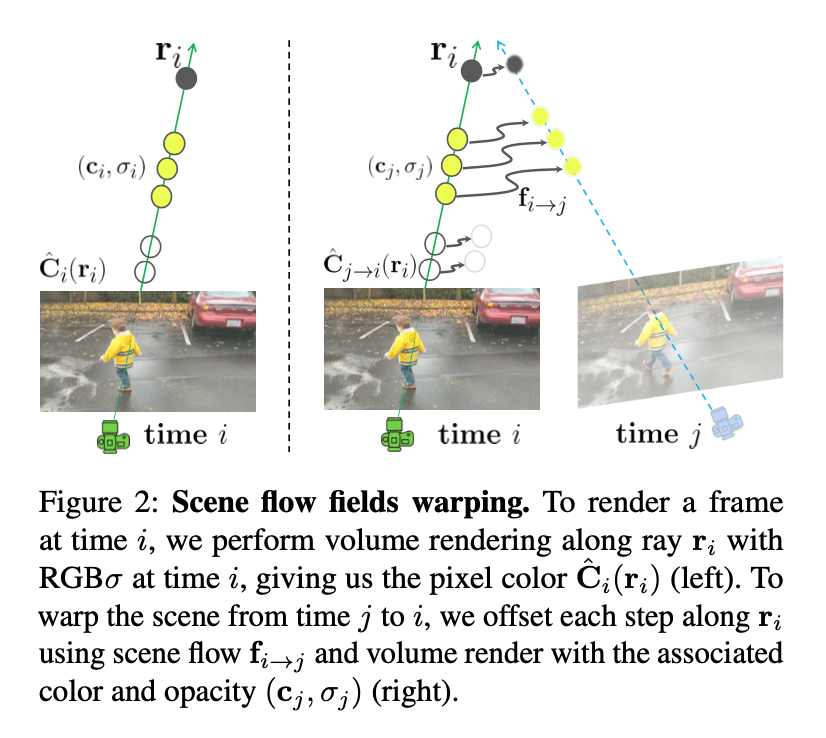
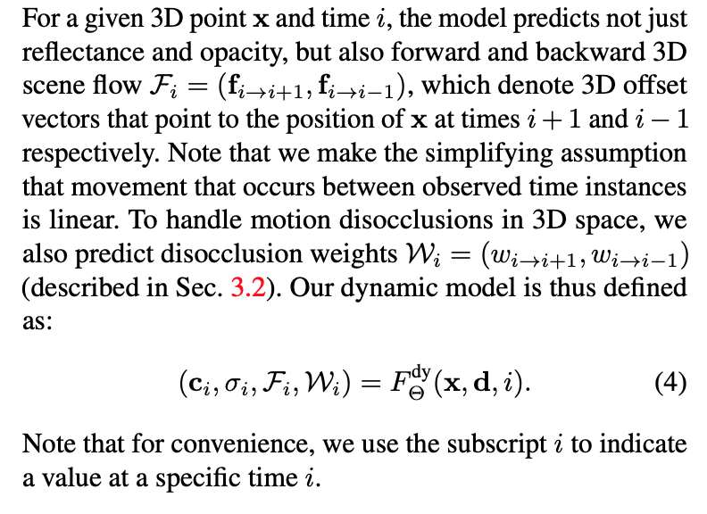
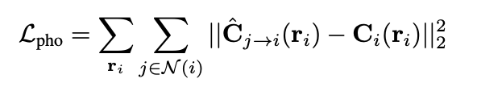
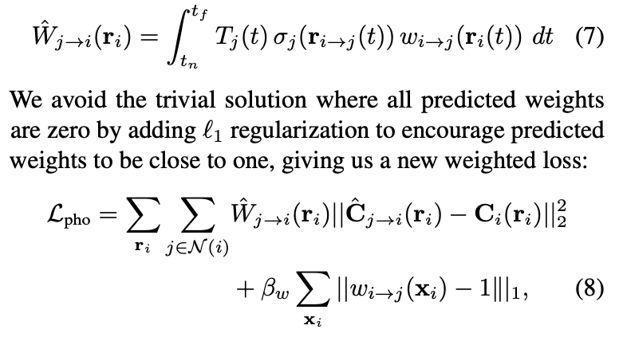
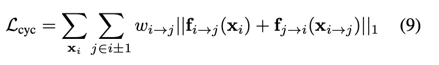
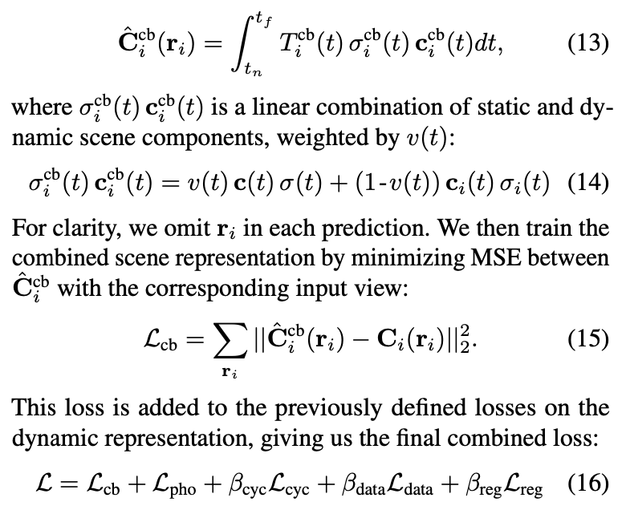

### Neural Scene Flow Fields for Space-Time View Synthesis of Dynamic Scenes

[**project**](https://www.cs.cornell.edu/~zl548/NSFF/)|[**paper**](https://arxiv.org/abs/2011.13084)|[**code**](https://github.com/zl548/Neural-Scene-Flow-Fields)

#### **Overview**

*We present a method to perform novel view and time syn- thesis of dynamic scenes, requiring only a monocular video with known camera poses as input.*

*We build upon prior work for static scenes, to which we add the notion of time, and estimate 3D motion by explicitly modeling forward and backward scene flow as dense 3D vector fields.*

#### **Technique**

1. **Temporal photometric consistency .**

   

   

2. **Scene flow priors**. 

   

2. **Data-driven priors**.

   The diffuse reflectance of an object remains constant while it is moving around. 
   
2. **Integrating a static scene representation**

   
   
   
   

#### **Note**

