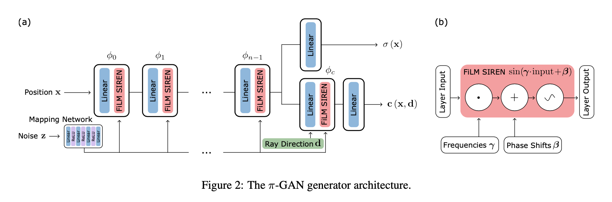
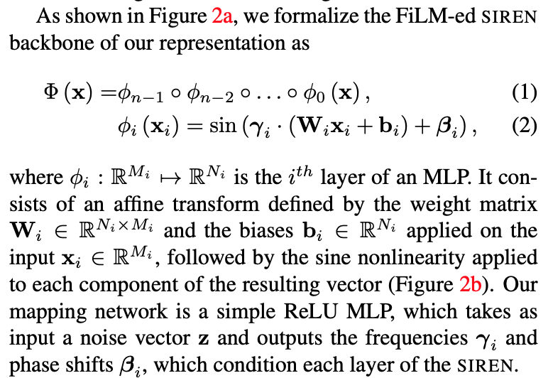

### pi-GAN: Periodic Implicit Generative Adversarial Networks for 3D-Aware Image Synthesis

CVPR 2021 (Oral)

[**project**](https://marcoamonteiro.github.io/pi-GAN-website/)|[**paper**](https://arxiv.org/abs/2012.00926)|[**code**](https://github.com/marcoamonteiro/pi-GAN)

#### **Overview**

*Existing approaches however fall short in two ways: first, they may lack an under- lying 3D representation or rely on view-inconsistent rendering, hence synthesizing images that are not multi-view consistent; second, they often depend upon representation network architectures that are not expressive enough, and their results thus lack in image quality. We propose a novel generative model, named Periodic Implicit Generative Adversarial Networks (*π*-GAN or pi-GAN), for high-quality 3D-aware image synthesis.* 

#### **Technique**

1. **SIREN-Based Implicit Radiance Field**

   

2. StyleGAN- inspired mapping network to condition the SIREN on a noise vector z through FiLM conditioning.

    

3. **ProgressiveGAN** idea

   Discriminator:
   
   We begin training at low resolutions and high batch sizes, during which the generator can focus on producing coarse shapes. As training progresses, we increase the image resolution and add new layers to the discriminator to handle the higher resolutions and discriminate fine details. For most experiments, we begin training at 32×32 and double the resolution twice during training, up to 128 × 128. 
   
   Generator:
   
   Our generator architecture does not grow; instead, we increase the resolution of the generator by sampling rays more densely from the same im- plicit representation.

#### **Note**

