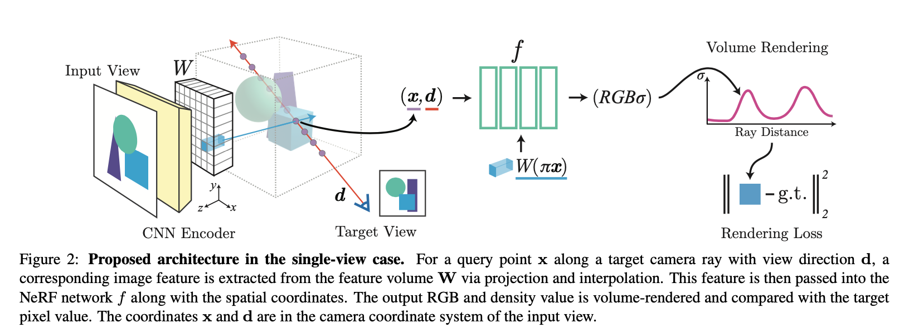

### pixelNeRF: Neural Radiance Fields from One or Few Images

[**paper**](https://arxiv.org/abs/2012.02190)|[**code**](https://github.com/sxyu/pixel-nerf)

#### **Overview**

*We propose pixelNeRF, a learning framework that predicts a continuous neural scene representation conditioned on one or few input images.*

Nerf has no scene prior or image features

In nerf, each scene must be optimized individually, with no knowledge shared between scenes.

#### **Technique**

1. Fix our coordinate system as the *view space* of the input image and specify positions and camera rays in this coordinate system.

1. Extract a feature map in input and project x onto the image plane to get the pixelwise feature using bilinear interpolation.

3. Incorporating Multiple Views

   In the few-shot view synthesis task, the query view direc- tion is a useful signal for determining the importance of a particular image feature in the NeRF network. If the query view direction is similar to the input view orientation, the model can rely more directly on the input; if it is dissimilar, the model must leverage the learned prior. 

   To obtain the output density and color, we process the coor- dinates and corresponding features in each view coordinate frame independently and aggregate across the views within the NeRF network. 

   

#### **Note**

