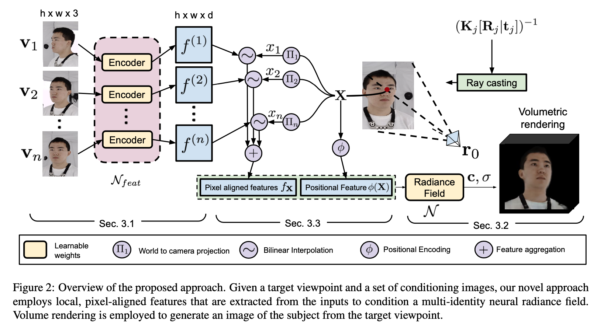

### Pixel-aligned Volumetric Avatars

[**project**](https://volumetric-avatars.github.io/)|[**paper**](https://volumetric-avatars.github.io/resources/paper.pdf)

#### **Overview**

A novel approach for predicting volumetric avatars of the human head given only a small number of images as input.

#### **Technique**

1. 3d point **X** is projected to 2d image pixel using camera intrinsic and extrinsic parameters according to the each input image ray direction. And then do bilinear interpolation on each f^(i)^ to get fx.

2. Explicitly take into the background.

   I~p~ = I~rgb~ + (1 − I~α~)I~bg~

#### **Note**

1. Limited extrapolation capa- bilities in terms of completely unobserved regions, e.g., the back of the head will not be reconstructed in detail if only front views are provided as example images. 
2. Not be ap- plied to in-the-wild data.

